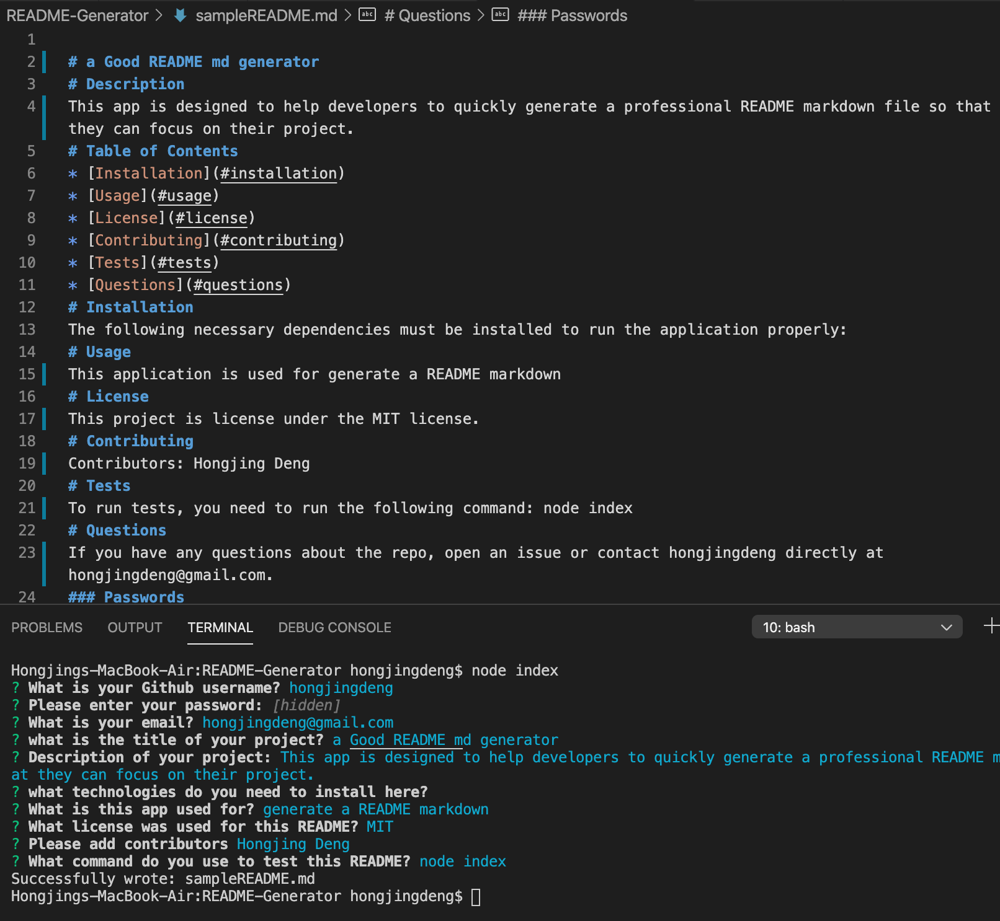

# This a Good READE.md Generator
[](https://github.com/)
## User Story
```
AS A developer
I WANT a README generator
SO THAT can quickly create a professional README for a new project
```
# Description
This app is designed to help developers to quickly generate a professional README markdown file so that they can focus on their project.
## 
# Table of Contents 
* [Installation](#installation)
* [Usage](#usage)
* [License](#license)
* [Contributing](#contributing)
* [Tests](#tests)
* [Questions](#questions)
# Installation
The following necessary dependencies must be installed to run the application properly: 
# Usage
​This application is used for generate a README markdown 
# License
This project is license under the MIT license.
# Contributing
​Contributors: Hongjing Deng
# Tests
To run tests, you need to run the following command: node index
# Demo

# Questions
If you have any questions about the repo, open an issue or contact hongjingdeng directly at hongjingdeng@gmail.com.